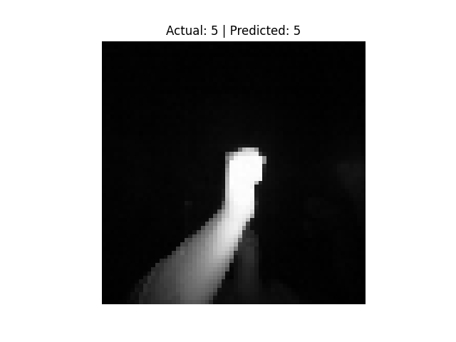

PRODIGY_ML_04

🎯 Task 04 - Hand Gesture Recognition using Support Vector Machine (SVM)

This task is part of my internship at Prodigy Infotech.

📌 Objective

Build a machine learning model using Support Vector Machine (SVM) to classify hand gestures based on grayscale images from the LeapGestRecog dataset. The aim is to enable gesture-based interaction through image recognition.

 📊 Dataset Used

- Source: Kaggle – [LeapGestRecog Dataset](https://www.kaggle.com/datasets/kmader/leapgestrecog)
- Structure:
leapGestRecog/
├── 00/
├── 01/
├── ...
└── 09/

- 10 gesture classes labeled from `00` to `09`
- Each folder contains subfolders with `.png` images of hand gestures

⚙️ Technologies Used

- Python
- Google Colab
- Libraries:
- OpenCV
- NumPy
- scikit-learn
- Matplotlib
- os
- joblib

🚀 How to Run the Project

1. Upload the `leapGestRecog.zip` dataset to your Google Drive and unzip it inside Colab.
2. Open the notebook: `task_04.ipynb`
3. Run the notebook cells to:
 - Load and preprocess the image dataset
 - Resize images to 64x64 and convert to grayscale
 - Train the SVM model
 - Evaluate its accuracy
 - Visualize predictions on sample gestures
 - Save or load the trained model

📈 Output Example

- Number of Classes: 10 (`00` to `09`)
- Image Size: 64x64 pixels
- Model Used: SVM Classifier
- Achieved Accuracy: ~97%
- Sample Visualization:

📂 Files Included

- `task_04.ipynb` – Main Colab notebook with full implementation
- 📦 [Download Trained Model (svm_gesture_model.pkl)](https://drive.google.com/file/d/1PPNYLDP2Nia91LtKf3hNdY7In5aFsglZ/view?usp=sharing)
- `sample_gestures/` – Folder containing visualized predictions for hand gestures
- `README.md` – Project documentation (this file)

✍️ Author

Kashish Tomar  
Intern at Prodigy Infotech – June/July 2025  
GitHub: [@kashishtomar-11](https://github.com/kashishtomar-11)
